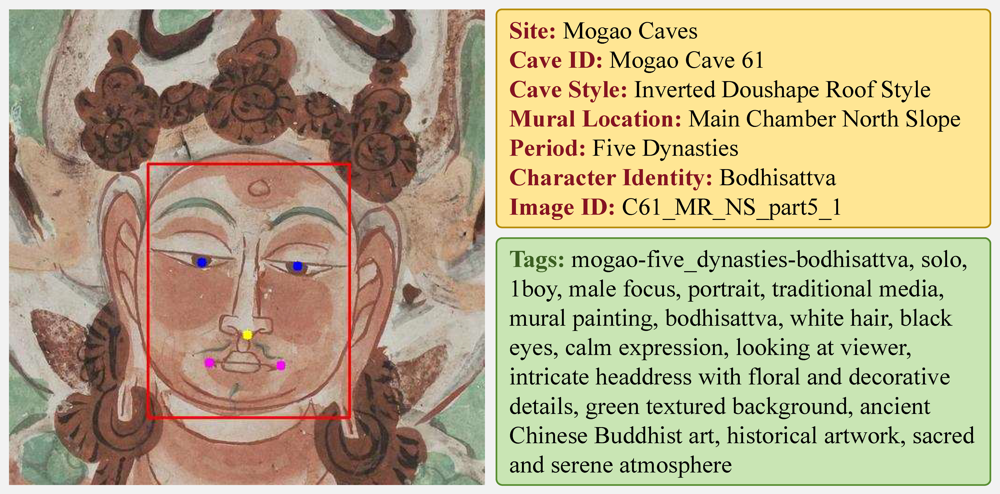

# Dunhuang_Faces
一个关于敦煌地区壁画中人脸形象的数据集.

***
## 关于数据集
数据集由论文"[Dunhuang_Faces: A Dataset Enhanced through Image Processing for Cultural Heritage and Machine Learning](
https://doi.org/10.18280/ts.420148)"提供, 原始数据来源为"[数字敦煌](https://www.e-dunhuang.com/)"项目.

- Dunhuang_Faces-20k
  - 485 张原始壁画图像
  - 19,126 个面部标注框
- Dunhuang_Faces-3K
  - 3,282 张五官完整图像
  - JSON 属性文件
- Dunhuang_Faces-500
  - 529 完整面部图像
  - JSON 属性文件
  - 描述性文本

### To Do:

  - [x] 面部标注框
  - [x] Dunhuang_Faces-3k 属性文件
  - [x] Dunhuang_Faces-500 描述性文本
  - [ ] 五官标注
  - [ ] 全属性文件
  - [ ] 描述性文本优化
***
## 下载地址
[Dunhuang_Faces](https://drive.google.com/drive/folders/16ohSYEPLvZyc2Qn7L3XjqUnW9tCuRgzc?usp=drive_link)
***
# Dunhuang_Faces
A dataset of facial images from murals in the Dunhuang region.

***
## About the dataset
This dataset is provided by the paper "[Dunhuang_Faces: A Dataset Enhanced through Image Processing for Cultural Heritage and Machine Learning](
https://doi.org/10.18280/ts.420148)", with the original data sourced from "[Digital Dunhuang](https://www.e-dunhuang.com/)".

- Dunhuang_Faces-20k
  - 485 original mural images
  - 19,126 face annotation boxes
- Dunhuang_Faces-3K
  - 3,282 imgs with full features
  - JSON attribute file
- Dunhuang_Faces-500
  - 529 complete facial imgs
  - JSON attribute file
  - Descriptive TXT file

### To Do:

  - [x] Face annotation box
  - [x] Attributes file of the Dunhuang_Faces-3k dataset
  - [x] Descriptive text of the Dunhuang_Faces-500 dataset
  - [ ] Facial feature annotation
  - [ ] Full attribute file
  - [ ] Text description optimization
***
## Download link
[Dunhuang_Faces](https://drive.google.com/drive/folders/16ohSYEPLvZyc2Qn7L3XjqUnW9tCuRgzc?usp=drive_link)
